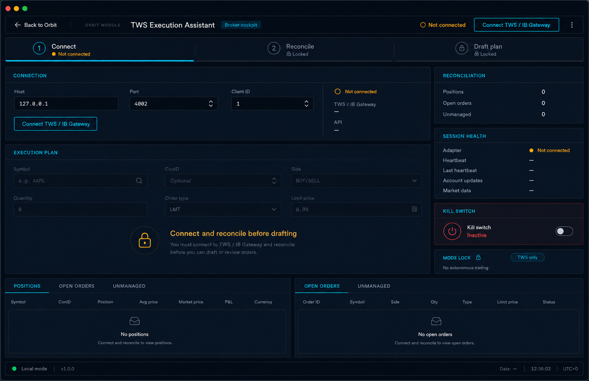

# TWS Broker Cockpit UI Design

## Problem

The current TWS Execution Assistant page reads like a centered settings form:
three same-looking cards, weak hierarchy, and no clear visual distinction
between connection, reconciliation, and execution-plan readiness.

## Approved Direction

Use the approved Broker Cockpit mockup:

The page should feel like an Orbit trading cockpit: compact top bar, dark
surfaces, cyan focus accents, amber disconnected/blocked states, mono numbers,
and clear safety gating.

## Tracer Bullet

Implement the disconnected-state UI only.

- Show a full-width cockpit shell instead of the centered stacked cards.
- Add a three-step gate strip: Connect, Reconcile, Draft plan.
- Keep the connection controls active.
- Visually lock the execution-plan form until connection and reconciliation.
- Keep reconciliation, session health, kill switch, and mode lock visible in a
  right rail.
- Keep positions and open-orders empty tables visible at the bottom.

## Out of Scope

- No backend changes.
- No new endpoint contracts.
- No order submission, arming, live mode, or adapter setting expansion.
- No new dependencies.
- No broad Orbit visual-system refactor.

## Verification

This is a UI-only slice with no changed critical trading promise. Use TypeScript
typecheck/build and a visual smoke of the disconnected state. Add no new tests.

## Policy Impact

No architecture, broker behavior, persistence, secrets, cloud, or trading-safety
policy changes. The UI reinforces the existing decision-support-only boundary by
locking drafting until connection/reconciliation are visible.
