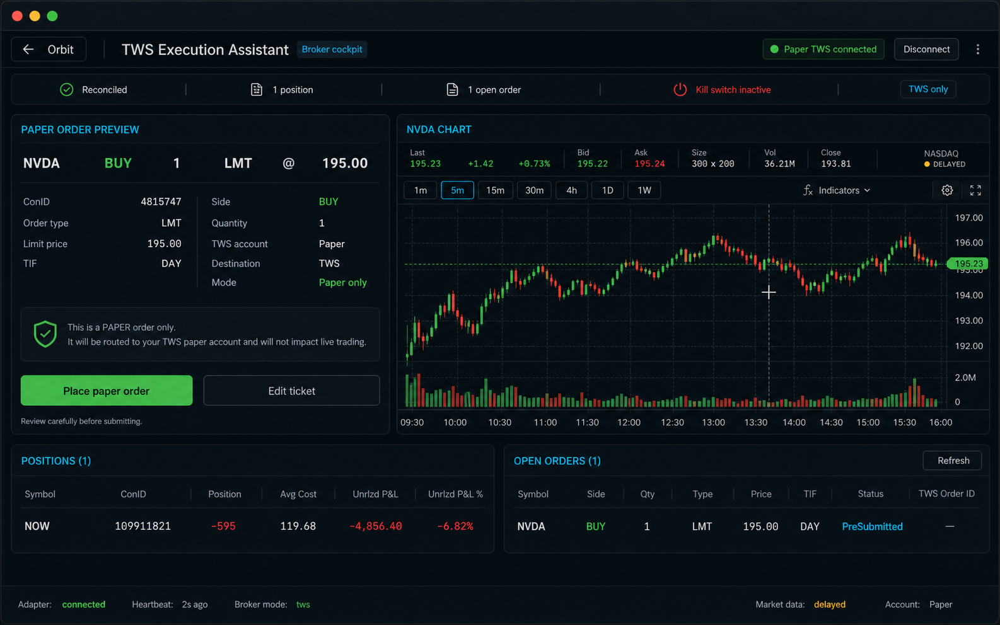

# TWS Terminal Cockpit Redesign

> Status: Approved direction
> Branch: `feature/tws-execution-assistant-spec`
> Date: 2026-06-28

## Problem

The TWS Execution Assistant now works for paper-order MVP testing, but the UI is
too click-heavy and repetitive:

- Order flow requires too many buttons: save draft, validate, preview, place.
- Connection status appears in multiple rows even though connection is handled
  outside the module.
- Open Orders can show a blank symbol for a submitted order.
- Disconnect reads like passive text, not an action.
- The page has too much empty space and does not yet support light mode well.

## Approved direction

Use a Bloomberg-terminal-inspired cockpit: dense, dark/light-token aware,
instrument-focused, and operational.

Mockup reference:

## Interaction model

The left main panel is stateful and never duplicates the same ticker:

1. **Ticket state:** user enters symbol, side, quantity, order type, and limit.
   Primary action is `Review paper order`.
2. **Review state:** paper preview replaces the ticket. Actions are
   `Place paper order` and `Edit ticket`.
3. **Submitted state:** submission receipt replaces preview. It shows broker
   order id, TWS status, and refresh affordance.

The normal flow becomes:

`Fill ticket -> Review paper order -> Place paper order`

Keep `Place paper order` as the explicit safety confirmation. Do not collapse it
into the review action.

## Layout

- Header keeps Orbit back, module title, `Paper TWS connected`, and a clear
  `Disconnect` button.
- Replace the three-step gate row and connection panel with one compact status
  strip: reconciled, positions count, open-orders count, kill switch, TWS only.
- Left column: stateful ticket / preview / submitted receipt.
- Right column: selected instrument chart and quote context.
- Bottom band: Positions and Open Orders side by side.

## Chart panel

The right chart panel is read-only market context for the selected `conid`.

Approved timeframe tabs:

`1m, 5m, 15m, 30m, 4h, 1D, 1W`

Default timeframe: `5m`.

Chart rules:

- No chart-driven order automation.
- No streaming chart requirement in the first UI redesign.
- No indicators in the first UI redesign.
- If TWS bars are not implemented yet, show a clean chart-unavailable state in
  the right panel.
- A separate follow-up may add read-only TWS bar data for the approved
  timeframes.

## Fixes included in the first pass

- Compress draft/validate/preview into `Review paper order`, using the existing
  backend calls internally.
- Keep `Place paper order` separate.
- Fix Open Orders symbol display for submitted orders.
- Make `Disconnect` visually read as a button.
- Audit TWS module light-mode contrast against existing Orbit `.light` tokens.

## Non-goals

- No live trading.
- No cancel/modify/reply.
- No new DB persistence.
- No restart recovery.
- No chart-driven execution.
- No Level 2/depth.
- No streaming quotes or streaming chart.
- No indicators.

## Slice order

1. **Workflow compression + open-order symbol + disconnect button**
   - One review action chains draft, validate, and preview.
   - Open Orders shows the symbol for submitted orders.
   - Disconnect has real button affordance.

2. **TWS cockpit light-mode audit**
   - Use existing Orbit `.light` and `.dark` CSS variables.
   - Fix module-only contrast and dark-only styling issues.
   - Do not add a new theme system.

3. **Terminal cockpit layout**
   - Remove duplicated connection panels.
   - Left panel becomes stateful ticket/preview/submitted.
   - Right panel becomes chart/quote context.
   - Bottom tables remain positions and open orders.

4. **Deferred follow-up: read-only TWS chart bars**
   - Add bars endpoint for `conid + timeframe`.
   - Support only `1m, 5m, 15m, 30m, 4h, 1D, 1W`.
   - Feed existing chart infrastructure if practical.

## Verification

- `npm run typecheck`
- Manual dark-mode smoke of ticket, review, submit, positions, open orders.
- Manual light-mode smoke of the same states.
- If chart bars are deferred, verify the chart panel empty state is clear and
  does not block order review/submission.

## Policy impact

This is UI workflow and read-only market-context planning. It does not change
trading safety policy, broker mutation rules, session exclusivity, or local/cloud
policy.
